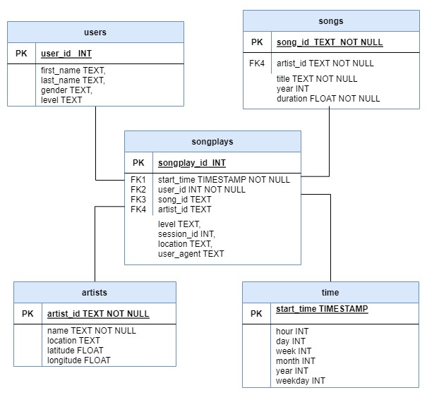

# Project: Spark and Data lake Project

## Introduction
A startup called **Sparkify** wants to analyze the data they've been collecting on songs and user activity on their new music streaming app. 

The analytics team is particularly interested in understanding what songs users are listening to. Currently, they don't have an easy way to query their data, which resides in a directory of JSON logs on user activity on the app, as well as a directory with JSON metadata on the songs in their app.

As a Data engineer assigned to this project, my role is to create a Postgres database with tables designed to optimize queries on song play analysis.

## Datasets
1. **`Song Dataset`**: The first dataset is a subset of real data from the Million Song Dataset. Each file is in JSON format and contains metadata about a song and the artist of that song. The files are partitioned by the first three letters of each song's track ID. For example, here are file paths to two files in this dataset.   
     >`s3://udacity-dend/song_data/A/B/C/TRABCEI128F424C983.json
song_data/A/A/B/TRAABJL12903CDCF1A.json`

    And below is an example of what a single song file, TRAABJL12903CDCF1A.json, looks like.
   > {"num_songs": 1, "artist_id": "ARJIE2Y1187B994AB7", "artist_latitude": null, "artist_longitude": null, "artist_location": "", "artist_name": "Line Renaud", "song_id": "SOUPIRU12A6D4FA1E1", "title": "Der Kleine Dompfaff", "duration": 152.92036, "year": 0}

2. **`Log Dataset`**: The second dataset consists of log files in JSON format generated by this event simulator based on the songs in the dataset above. These simulate activity logs from a music streaming app based on specified configurations. For example, here are filepaths to two files in this dataset.
    > `s3://udacity-dend/log_data/2018/11/2018-11-12-events.json
log_data/2018/11/2018-11-13-events.json`
    
    And below is an example of what the data in a log file, 2018-11-12-events.json, looks like.
   > {"artist":null,"auth":"Logged In","firstName":"Walter","gender":"M","itemInSession":0,"lastName":"Frye","length":null,"level":"free","location":"San Francisco-Oakland-Hayward, CA","method":"GET","page":"Home","registration":1540919166796.0,"sessionId":38,"song":null,"status":200,"ts":1541105830796,"userAgent":"\"Mozilla\/5.0 (Macintosh; Intel Mac OS X 10_9_4) AppleWebKit\/537.36 (KHTML, like Gecko) Chrome\/36.0.1985.143 Safari\/537.36\"","userId":"39"} 
   

   
   
## Running the python scripts

1. Before running the queries make sure you have a IAM user having sufficient permission for using access key and secret.
2. Update dl.cfg to include your Access_Key and Access_Secret. (**Remember to delete these before submission**)
3. Create an EMR cluster to load and transform the data, Create a S3 Bucket to store the output parquet files.
4. Complete **etl.py**
5. **etl.py**: Run etl.py on EMR to process the entire datasets.
6. **etl.ipynb**: Python Notebook ran on EMR cluster to test the code.

## Files in the Datasets
1. **song_data**: Contains data related to songs. This dataset is used to populate **songs_table, artists_table and songplays_table** table
2. **log_data**: Contains logs for song plays. This dataset is used to populate **users_table, time_table and songplays_table** table

## Schema

For analysis, I have created star schema using the song and log datasets. There is fact table (songplays) and 4 dimension tables (users, songs, artists, and time). The schema is defined as per the below diagram.
     

Star Schema will provide better flexibility on queries for song play analysis.

## Fact and Dimension Tables
1. **songplays**: This is the Fact table that takes song_id and artist_id from song_data and all other fields from log_data.
2. **users**: This is one of the dimension table that takes all fields from log_data table
3. **songs**: This is one of the dimension table that takes all fields from song_data table
4. **artists**: This is one of the dimension table that takes all fields from song_data table
5. **time**: This is one of the dimension table that takes all fields from log_data

